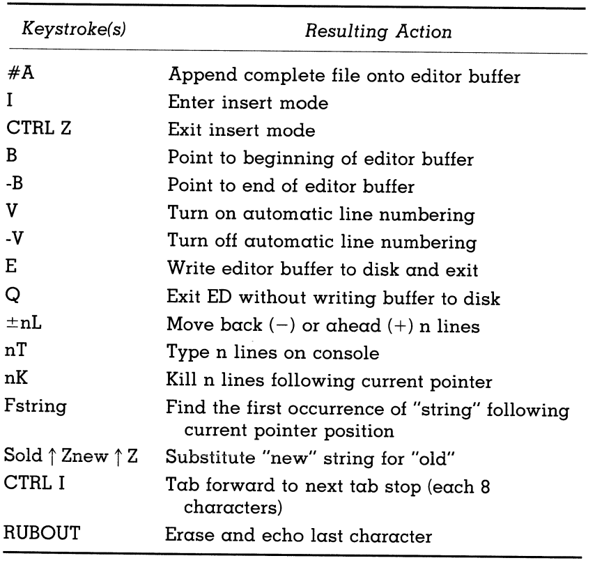

# Console Input/Output

- The stack allows for nested subroutines
https://www.geeksforgeeks.org/subroutine-subroutine-nesting-and-stack-memory/
- The microprocessor is keeping track of the return adresses of subroutines in a first-in-last-out "stack"
- I have to keep reminding myself that this was written in 1983 and thats why it uses all these funny words
- BDOS call at location 5 is for interacting with I/O devices
- The optional 8th parity bit of ASCII characters should be masked off after receiving them from an input device

##

- comments are with (;)

- First line of a program should have a date of last edit

- Use declared constants

- -B takes the cursor to the end of the last line

- (n)K removes the text from n lines past the cursor

- F(n) find firds first occurrence of string n

- program labels should end with a colon for the F(n)

- 

